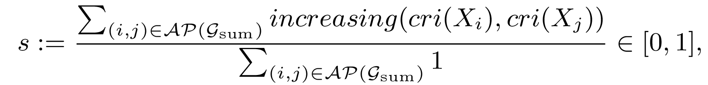
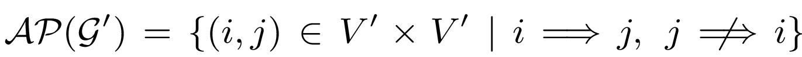
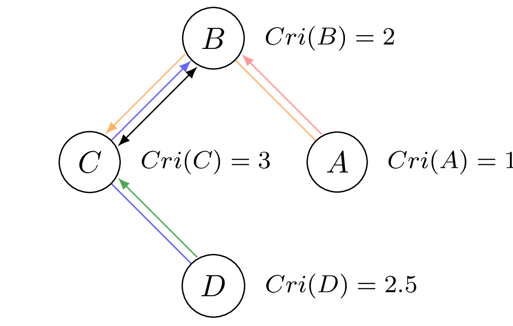
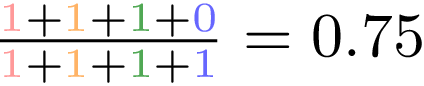

# Sortability of Time Series Data

Code for the Paper [Sortability of Timeseries Data](https://openreview.net/forum?id=OGvmCpcHdV) by Christopher Lohse and Jonas Wahl.
If you use the code please consider citing

```
@article{lohse2024sortability,
    title={Sortability of Time Series Data},
    author={Christopher Lohse and Jonas Wahl},
    journal={Transactions on Machine Learning Research},
    year={2025},
}
```


## Method
For any causal model containing the variables {X^(1), …, X^(d)} with a (non-degenerate) adjacency matrix *W*, the sortability score is the fraction of directed paths that start from a node with a strictly lower sortability criterion than the node they end in[1]. 
As the presence of cycles would dilute the sortability signal and would naturally push it closer to 1/2. In other words, R²- and varsorting of cyclically connected processes is meaningless, and we are only interested in whether nodes that are not cyclically connected can be sorted. Our sortability criterion modifies Reisach et al. 2021[1] and Reisach et al. 2023[2] and adapts it to the time series setting. We define it as:



where  is the set of admissible node pairs (the long double arrow indicates the existence of a directed path).




For the example above the sortability score *s* can be calculated with .
The contribution of the pairs (B, C) and (C, B) is ignored since the two nodes belong to the black cycle. Cycle-free directed paths that connect admissible node pairs are depicted in colour.
If we were to calculate it including cyclically connected pairs, it would result in approximately 4/6 ≈ 0.67.

## Setup

To use the implementation of the varsortability and r2sortability for timeseries data you can install the library in your existing python environment by first cloning the repository:
```
git clone https://github.com/ChristopherLohse/sortabilityTime.git
```
and then installing it with
```
pip install dist/sortabilitytime-0.1.0-py3-none-any.whl
```
To rerun the experiments located in the `experiments` folder first install all dependencies

```
pip install -r requirements.txt
```
To run the Causalchamber Datasets just make the directory
```
mkdir Data/Causalchamber
```
Each Dataset: Causalchamber, ER, Graphs. NEURIPS competition, River Data has its own Notebook.
By running the Notebook the files will download automatically.
For the river data the pickle files are provided. 
For the NEURIPS Competition the data was requested by the [competition organisers](https://causeme.uv.es)
and the ground truth is therefore not included and would 
need to be located in `Data/NeuripsCompetition/neurips-causeme-ground-truths` along with one folder per data file in the `Data/NeuripsCompetition/` directory.
The ER Graphs do not need any data files.


[1] Reisach, Alexander, Christof Seiler, and Sebastian Weichwald. "Beware of the simulated dag! causal discovery benchmarks may be easy to game." Advances in Neural Information Processing Systems 34 (2021): 27772-27784.

[2] Alexander Gilbert Reisach, Myriam Tami, Christof Seiler, Antoine Chambaz, and Sebastian Weichwald. A scale invariant sorting criterion to find a causal order in additive noise models. In Thirty-seventh Conference on Neural Information Processing Systems, 2023.